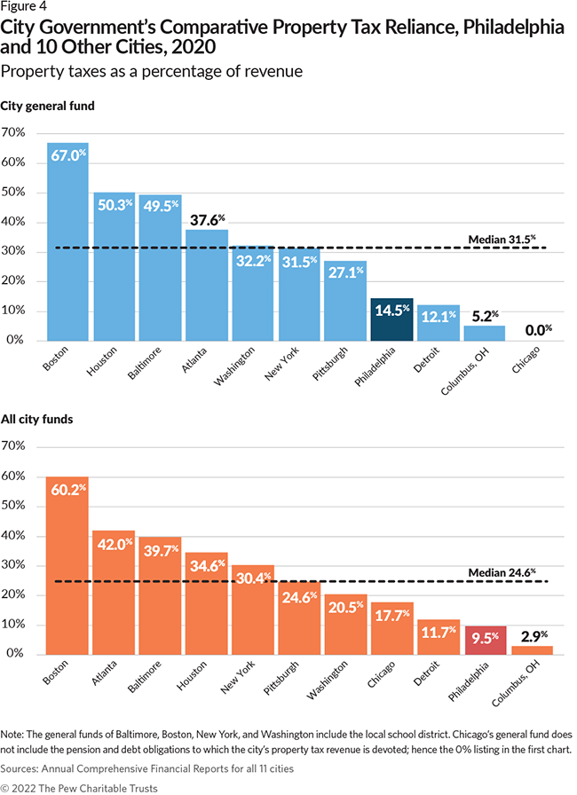
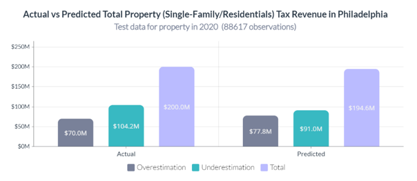

# Business Understanding
## Context

**Tentang Kota Philadelphia**

  

Philadelphia adalah kota terbesar di negara bagian Pennsylvania, Amerika Serikat. Meskipun bukan merupakan ibu kota negara bagian, (ibu kota Pennsylvania adalah Harrisburg), Philadelphia merupakan salah satu kota paling bersejarah di Amerika. Menurut sensus tahun 2000, Philadelphia ditetapkan sebagai kota terbesar kelima di Amerika Serikat. Perkiraan penduduknya pada 30 Juni 2005 adalah 1.470.151 jiwa. Luasnya adalah 349,9 km². Kota ini memiliki ekonomi yang kuat dan beragam , sebagai salah satu sumber pendapatan utama bagi pemerintah kota, pajak properti memiliki peran penting dalam mendukung pengembangan dan penyediaan layanan publik di Philadelphia.

  

Gambar di atas juga menunjukkan persentase pendapatan yang diwakili oleh pajak properti di Philadelphia dan 10 kota lainnya untuk tahun fiskal 2020, tahun terbaru yang data lengkapnya tersedia. Bagian pendapatan dari pajak properti di Philadelphia sebesar 14,5% dari pendapatan dana umum, kurang dari separuh median 31,5%. Dalam hal pendapatan kota secara keseluruhan, pajak properti memberikan kontribusi sebesar 9,5% di Philadelphia, lebih rendah dibandingkan dengan kota lain yang dipertimbangkan kecuali Columbus, dan juga kurang dari separuh median. 
Data terbaru di tahun 2020, dilansir pada tautan https://www.pewtrusts.org/en/research-and-analysis/reports/2022/09/how-property-is-taxed-in-philadelphia, total pendapatan (*general revenue*) Kota Philadelphia berjumlah $4,834 M dengan rincian sebagai berikut:
- $  699 M   (14.5%) dari pajak properti
- $2,124  M  (43.9%) dari pajak upah, penghasilan, dan laba bersih
- $1,229 M    (25.4%) dari pajak lainnya
- $  782  M  (16.2%) dari selain pajak

Dari data di atas dapat dilihat bahwa pajak Kota Philadelphia berkontribusi cukup rendah pada pendapatan kota dibandingkan kota-kota lainnya. Oleh karena itu, kasus ini menjadi penting karena dengan adanya model yang dapat memprediksi harga pasar properti secara akurat berpotensi mengoptimalisasi pendapatan kota.

Maka dari itu `The Office of Property Assessment (OPA)` adalah salah satu departemen dalam pemerintahan Kota Philadelphia yang bertugas untuk menentukan nilai setiap properti di Philadelphiac memiliki peranan penting. Dimana asesmen harga properti dari OPA digunakan untuk menghitung pajak properti yang harus dibayar oleh pemilik.

Secara terbuka, OPA menerima pengajuan untuk pengurangan maupun pengecualian yang dapat mengurangi pajak properti. Jika pemilik properti tidak setuju dengan penilaian atau yakin bahwa pengurangan atau pengecualian belum diterapkan dengan benar, OPA menawarkan pilihan untuk meminta peninjauan ulang atau mengajukan banding. Oleh karena itu, sebagai stakeholder, OPA membutuhkan analisis secara mendalam dan sebuah alat atau tool yang dapat membantu OPA dalam menentukan harga properti secara akurat. Kasus ini menjadi sangat penting karena pajak merupakan salah satu sumber pendapatan pemerintah yang akan digunakan untuk perencanaan anggaran kota.

Dalam skala besar, setiap negara memiliki target pendapatan melalui pajak dengan ketentuan dan sistem yang berbeda-beda. Skala lebih kecilnya, pendapatan dari pajak tersebut dikumpulkan dari region, subregion, maupun kota. Pendapatan ini akan dialokasikan dalam beberapa klasifikasi anggaran sesuai kebutuhan kota, termasuk pembangunan, pendidikan, maupun fasilitas umum. Kota Philadelphia memiliki dataset yang berisi harga pasar (market value) setiap properti di kota yang digunakan untuk perhitungan pajak. Seiring berjalannya waktu, akan ada properti-properti baru yang dibangun di Kota Philadelphia yang harga pasarnya belum ditaksasi. Oleh karena itu, penting bagi pemerintah untuk mengetahui proyeksi nominal pendapatan yang akan diterima sebelum menyusun anggaran agar alokasi anggaran menjadi tepat sasaran sesuai target.
Selain itu, menurut Thumbtack, waktu yang dibutuhkan untuk pembuatan laporan setelah dilakukan survei rata-rata 2 minggu. Sehingga OPA membutuhkan sebuah alat/tools untuk membantu menentukan harga pasar properti dengan cepat dan tepat.
   

## Problem Statement
1. Bagaimana cara memprediksi harga pasar properti dengan akurat sehingga perhitungan pajak menjadi akurat?
2. Alat/tools apa yang sebaiknya digunakan untuk menghitung nilai properti secara cepat dan akurat?
3. Apa saja variabel yang memiliki pengaruh signifikan terhadap harga pasar properti di Kota Philadelphia?

## Goal
Membangun tool atau sebuah model prediktif berbasis machine learning yang dapat membantu OPA dalam **memprediksi harga pasar properti tipe single-family/residential di Kota Philadelphia yang belum ditaksasi**. Baik bangunan baru maupun bangunan lama yang memerlukan asesmen baru. Dengan menggunakan hasil prediksi model ini untuk menentukan harga pasar properti, diharapkan dapat membantu pemerintah dalam menentukan nilai pajak properti yang lebih akurat. Dengan penilaian yang lebih tepat, diharapkan pendapatan kota dari pajak properti dapat terserap dengan akurasi yang maksimal.

## **Analytic Approach**

 Jadi dari penjabaran di atas, kami akan menganalisis data untuk dapat menemukan pola dari fitur-fitur yang ada, yang membedakan fitur tertentu seperti lokasi, tanggal, luas dengan yang lainnya dalam hal market value pada jenis gedung perumahan (Residentials atau single Family).

Selanjutnya, kami akan membangun suatu model regresi yang akan membantu perusahaan/badan/lembaga untuk dapat menyediakan 'tool' atau model prediktif yang mampu prediksi market value of property (khususnya jenis perumahan/Residentials) di kota philadelpia di waktu dan lokasi tertentu. Disini kami akan melakukan eksperimen dengan beberapa algoritma model regresi yang sering digunakan seperti Linear Regression, KNN, SGD, Random Forest, XGB, dan LGBM. Dimana kami akan memilih satu model (atau gabungan dari beberapa model) untuk membuat tool tersebut yang sesuai dengan data dari Office of Property Assesment (OPA) 

https://opendataphilly.org/datasets/philadelphia-properties-and-assessment-history/. 

## Evaluation Metrics
1. MAE (Mean Absolute Error)
2. RMSLE (Root Mean Squared Log Error)
3. MAPE (Mean Absolute Percentage Error)

## **Error Goals**
Error goals /toleransi error /kriteria penerimaan model mengacu pada tingkat error yang dapat diterima dalam model, apakah model yang dibangun memenuhi kriteria atau tidak.  

Error target/goals yang akan kita coba capai adalah 

|**Metric** | **Target**
|----- | ----- |
|MAE| <= $42k 
| MAPE | <= 13%
| RMSLE | <= 0.239

# Data Understanding
## Attributes Information & EDA
1. Terdapat 6 kategori properti: Single Family, Multi Family, Mixed Use, Vacant Land, Commercial, dan Industrial.
2. Kategori Single Family mendominasi hampir 80% dataset.
3. Mayoritas persebaran data pada fitur-fitur diasumsikan tidak terdistribusi normal sehingga interpretasi data akan menggunakan median.
4. Fitur yang merepresentasikan keadaan rumah yaitu luas tanah, luas bangunan, jumlah ruangan, jumlah kamar tidur, jumlah kamar mandi, ada garasi/tidak, jumlah lantai bangunan, kondisi eksterior dan interior, tahun pendirian bangunan, dll.
5. Fitur yang merepresentasikan lokasi seperti kode pos, nama jalan, nomor rumah, kode state, zona, dll.
6. Fitur lainnya mencerminkan nama pemilik, tahun penjualan properti, harga penjualan, dll.

Attributes Information dan EDA secara lengkap dan rinci dapat dilihat pada Notebook.

   
# Preprocessing
Pada tahap ini, kita akan melakukan cleaning pada data yang nantinya data yang sudah dibersihkan akan kita gunakan untuk pemodelan. Beberapa hal yang dilakukan adalah:

1) Data Cleaning
- Drop data duplikat jika ada.
- Cek format penulisan data apakah sudah benar atau belum (jika ada).
- Drop fitur yang tidak memiliki relevansi terhadap harga market properti.
- 
 Melakukan treatment terhadap missing value jika ada. Bisa dengan cara men-drop fiturnya jika memang tidak dibutuhkan atau bisa juga dengan mengimputasi dengan nilai yang paling masuk baik secara *domain knowledge* maupun secara statistik. 

- Pengecekan Outliers

2) Feature engineering adalah proses membuat, memilih, atau mengekstraksi fitur (features) yang relevan dari data mentah (raw data) untuk digunakan dalam proses pembelajaran mesin (machine learning). Tujuan utama dari feature engineering adalah meningkatkan kualitas data yang akan digunakan oleh algoritma pembelajaran mesin sehingga menghasilkan model yang lebih baik dan performa yang lebih baik pula. Kita akan melakukan :
   - ekstraksi fitur (**feature extraction**) 
   - konstruksi fitur (**feature construction**) atau pembuatan fitur (**feature creation**)
   
3) Data Transformation
- langkah ini melibatkan pengubahan data ke dalam format yang lebih cocok untuk pemodelan regressi untuk memprediksi harga market properti. Ini dapat mencakup normalisasi data numerik, membuat variabel dummy, dan mengkodekan data kategorikal.

# Modelling
Menggunakan uji RandomForest Regressor, XGBoost Regressor, dan LGBM Regressor dengan cross validation (n=5). Berikut hasilnya:

|No|Model|	Mean_MAE	|Std_MAE	|Mean_MAPE	|Std_MAPE|	Mean_RMSLE|	Std_RMSLE|	Mean_R-Squared	|Std_R-Squared|	cv duration (minutes)|
| ----- | ----- | ----- | ----- | ----- | ----- | ----- | ----- | ----- | ----- | ----- 
|0	|RandomForest Regressor|	-19521.498159|	336.152118|	-0.134994|	0.001733|	-0.251128|	0.002205|	0.887309|	0.004283|	55.706672|
|1	|XGBoost Regressor|	-30907.723678|	245.324789|	-0.227797|	0.001998|	-0.316795|	0.001585|	0.829019|	0.004729|	2.231662|
|2|	LGBM Regressor	|-33859.785435|	319.672300|	-0.250820|	0.001987|	-0.339223|	0.002319|	0.795712|	0.005851|	0.412182|

 Dari hasil Model Benchmarking di atas, dilihat dari semua metrics yang ada maka Model dengan algoritma Random Forest memiliki nilai error yang paling rendah. Tapi kelemahan dari Random Forest adalah waktu/durasi untuk training nya cukup lama jika dibandingkan dengan XGBoost dan LGBM.

Selain itu dari hasil MAPE yang didapatkan bisa dibilang cukup rendah pada ketiga model ini, yang menandakan nilai prediksi yang lebih tinggi jika dibandingkan nilai aktual (overestimation) dapat di handel dengan cukup baik pada prediksi registered users, karea MAPE sensitif terhadap nilai prediksi yang overestimated. Sedangkan untuk RMSLE nya juga nilainya cukup kecil, yang artinya nilai prediksi yang lebih rendah dari nilai aktual nya (underestimation) dapat di handel dengan cukup baik juga, dimana RSMLE sensitif terhadap error pada nilai prediksi yang underestimated. 

## Feature Importances
5 fitur terbaik, antara lain:
- `property_age`
- `total_area`
- `overall_condition`
- `total_livable_area`
- `region`

Sesuai dengan pengetahuan umum bahwa kelima fitur ini akan cenderung memiliki pengaruh yang signifikan untuk pemodelan.
Ada beberapa fitur yang tidak penting yang dihapus agar mempercepat waktu pelatihan dan prediksi, mengurangi overfitting, meningkatkan interpretabilitas, mengurangi kompleksitas dan biaya.

## Hyperparameter Tuning
Setelah dilakukan tuning kami mendapatkan best_parameter untuk model terbaik pada dataset ini : 
'model__regressor__n_estimators': 1000, 'model__regressor__min_samples_split': 3, 'model__regressor__min_samples_leaf': 1, 'model__regressor__max_features': 'auto', 'model__regressor__max_depth': 80, 'model__regressor__bootstrap': True}

Testing model terbaik **sebelum** di tuning:
| |	MAE	|MAPE|	RMSLE	|R-Squared|
|-----|-----|-----|-----|-----|
|RandomForest	|16983.233208	|0.116652|	0.238205	|0.898697|

Testing model terbaik **setelah** di tuning:
| |	MAE	|MAPE|	RMSLE	|R-Squared|
|-----|-----|-----|-----|-----|
|RandomForest	|16924.340992|	0.115968|	0.23706|	0.89855|

Terjadi peningkatan performa pada masing-masing metric sebesar:

- MAE : 0.35%
- MAPE : 0.59%
- RMSLE : 0.48%
- R-Squared : 0.02%

## Number of features
Pada data akhir, model kami hanya menggunakan 10 fitur/variable saja untuk memprediksi harga pasar properti dengan tipe residensials, yaitu :
'depth', 'frontage', 'total_area', 'total_livable_area', 'property_age', 'total_rooms', 'overall_condition', 'is_there_a_garage', 'new_zoning', 'region'

## Final Model Performance
**Dari tahapan pemodelan, berikut performa model akhir (final) kami :**
| |	MAE	|MAPE|	RMSLE	|
|-----|-----|-----|-----|
|RandomForest	|$16.92k|	11.59%|	0.237|

## **Total Property Tax Revenue (simple simulation)**
Dari sumber resmi yang kami dapat (https://www.phila.gov/services/payments-assistance-taxes/taxes/property-and-real-estate-taxes/real-estate-tax), besar **tarif pajak** untuk real estate/ residensial di kota philadelphia yaitu **1.3998%**. Maka dari itu kami mencoba membuat simulasi perhitungan pajak secara kasar, dengan asumi semua wajib pajak membayar pajak propertinya. 

**𝑇𝑎𝑥 𝑅𝑒𝑣𝑒𝑛𝑢𝑒 = 1.3998% x 𝑇𝑜𝑡𝑎𝑙_𝑚𝑎𝑟𝑘𝑒𝑡_𝑣𝑎𝑙𝑢𝑒**\

Dari grafik di bawah dapat disimpulkan bahwa :

Model yang kami bangun cenderung untuk melakukan underestimation, sehingga nilai pajak yang didapat lebih rendah dari nilai aktualnya. Akan tetapi perbedaan nya tidak terlalu jauh yaitu hanya sebesar 3%.

 

# Conclusions and Recommendations
## Conclusions  

### Characteristics of historical data (from EDA).
1. Hubungan linier negatif antara harga properti residensial dengan kondisi properti (interior & eksterior)
2. Terjadi fluktuasi harga properti yang dijual pada rentang tahun 1918-1944. Mulai stabil pada tahun >=1944
3. Ada korelasi yang positif antara harga market properti dengan luas bangunan dan tanah.
4. Harga properti dengan median tertinggi terdapat pada region center city.
5. Properti dengan umur ≤𝟏𝟎𝟎 𝒕𝒂𝒉𝒖𝒏 --> Tren median harga properti turun  
   Properti dengan umur >𝟏𝟎𝟎 𝒕𝒂𝒉𝒖𝒏 --> Tren median harga properti naik

### Modeling result
Model yang dibangun memiliki nilai **MAE : $16.92k , MAPE : 11.59%, RMSLE : 0.237**. Secara keseluruhan, meskipun nilai MAE tergolong cukup besar (dibandingkan nilai median harga market properti yaitu $127.1k) tapi tingkat MAPE dan RMSLE yang relatif rendah menunjukkan bahwa dalam memperkirakan harga properti tipe single-family di Philadelphia, model ini memiliki tingkat akurasi yang relatif baik, dimana artinya nilai prediksi cenderung mendekati nilai aktual secara keseluruhan

2. Performa Model kami memiliki nilai  MAE : $16.92k , MAPE : 11.59%, dan RMSLE : 0.237 telah mencapai target error/error goals yang ditetapkan yaitu  (MAE ≤ $42k , MAPE ≤ 13% , dan RMSLE : 0.239)

3. Berdasarkan model yang dibuat (dilihat dari feature importance) fitur-fitur `property_age`, `total_area`, `overall_condition`, `total_livable_area` dan `region` menjadi fitur yang paling berpengaruh terhadap nilai prediksi harga market properti.

4. Dari analisa kesalahan (*error analysis*) yang dilakukan pada 4 fitur terpenting, terdapat beberapa kondisi pada fitur-fitur tersebut yang membuat model memiliki nilai error yang besar :
    - `property_age` pada nilai 95, 100 dan 105 tahun
    - `total_area` atau luas tanah yang memiliki nilai 0 (artinya tanah nya sempit, tapi luas bangunan besar --> rumah susun/apartemen kecil)
    - `overall_condition` atau kondisi rumah (interior dan eksterior) pada nilai 4 (average) --> sebaran nya paling banyak yaitu di atas 70%
    - `total_livable_area` atau luas bangunan pada nilai 0 dan rentang nilai 1200-1210 sqft
    - `region` yaitu di wilayah phiadelphia utara (north) karena sebaran data nya paling banyak dan selatan (south) karena harga nya beragam atau tidak linier (wilayah ini berada tepat di tengah wilayah dengan nilai median market tertinggi dan terendah )

## Recommendations
### For OPA, from characteristics of historical data : 
1. Pastikan penilaian mengenai kondisi rumah (interior dan eksterior) memiliki penilaian yang konsisten.
2. Perhatikan tahun-tahun dimana harga properti memiliki fluktuasi yang tidak menentu. (contoh : 1918-1944 era Perang Dunia, covid : 2019-2020)
3. Jika memungkinkan, luas tanah atau luas bangunan yang sempit/kecil jangan ditulis 0, tapi berikan nilai eksak nya.
4. Pemerintah dapat lebih memperhatikan bangunan-bangunan lama (umurnya di atas 100 tahun) , karena memiliki nilai value yang tinggi.

### For Model : 

1. Saat mengecek prediksi mana saja yang memiliki nilai error yang tinggi dan karakteristik untuk 5 fitur terpenting. Pada akhirnya kita dapat mengetahui sebenarnya variabel mana saja dan aspek apa yang menyebabkan model menghasilkan error yang tinggi dengan lebih mendalam, sehingga kita bisa melakukan training ulang dengan penerapan feature engineering lainnya.

2. Jika ada penambahan banyak data, dapat dicoba dengan menggunakan model yang lebih kompleks, seperti recursive neural networks (RNN). Namun, kalau jumlah data dan fiturnya masih seperti dataset ini, kemungkinan besar tidak akan mengubah hasilnya secara signifikan.

3. Model yang sudah dibangun ini bisa dimanfaatkan untuk pengembangan pembuatan model lainnya. Misalkan kita ingin membuat model yang bisa memprediksi properti dengan kategori lain misalkan properti industri maupun apartemen {multi family)

4. Melakukan tuning hyperparameter yang lebih impresif (memperluas parameter space atau menggunakan metodologi lain seperti Bayesian, GridSearch dll), untuk mendapatkan performa terbaik (dan mengurangi overfiiting). Tapi memang dibutuhkan resource/komputer dengan kemampuan komputasi yang lebih tinggi untuk model RandomForest.
